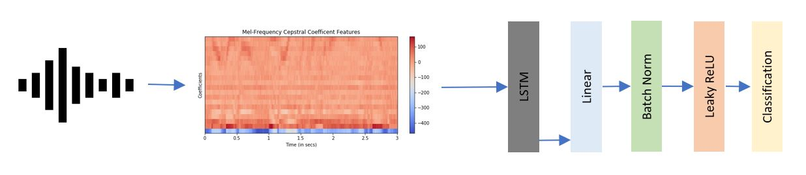
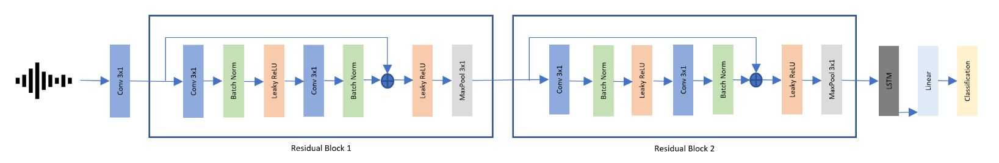

# VoiceID: An End-to-End Text-Independent Speaker Verification System

### Introduction:
It is a end-to-end speaker verification system that aims to confirm the identity of a speaker by matching some representation of an incoming test phrase to that of a set of speaker-dependent enrolment phrases. In this project, we first show a baseline LSTM system proposed in [1]. We then proposed a end-to-end system that works directly in raw waveforms and doesn't require any pre-processing.

 "Baseline LSTM System [1]"

 "Proposed End-to-End System"

### Dataset:
In this project, we are introducing a new limited vocabulary spoken commands dataset which we named 'PS60k'. PS60k has total 60K utterances of 'Hey Siri' and 'Hey Portal' combined. We recorded 60 speakers, 20 from each nationality - China, India and the United States of America. Each speaker speaks 20 different utterences (10 Hey Siri utterances, 10 Hey Portal utterances). Theese total 1200 original recordings are merged with 10 different types of noises at 5 SNR (-5, 0, 10, 15, 25) levels. PS60k dataset is available as per request to author. Please contact Piyush Vyas at pi.yush@icloud.com or Darshan Shinde at darshinde7802@gmail.com

### Code distribution:
VoiceId repository has three python files. 
1. gen_data.py: This file generate the PS60k dataset from original speaker utterances and 10 noise recordings.
2. baseline.py: This file contains the complete source code for baseline LSTM system, training and testing baseline model.
3. e2e.py: This file contains the complete source code for proposed end-to-end system, training and testing the end-to-end model.

### Basic requirements:
1. To run this model, you will need python 3.7.4 version installed on your system.
2. The uploaded code requires python libraries like librosa, libsndfile, audioread, sklearn, pytorch-1.3.0, cuda-10.1, numpy, etc. installed in your python environment.
3. To train the model, you will at least 16GB GPU memory. The written code supports multi-GPU training, but all GPUs should be on same node. 

### How to run:
1. Generate data:  
   i.   Clone VoiceId reposity.  
   ii.  Request original dataset from the author.    
   iii. Download and store it inside the cloned repository at the same level where source code is present.  
   iv.  Generate a new directory by the name of PS60k.  
   v.   Run gen_data.py code to generate the PS60k dataset.   
2. Train and Test baseline LSTM model:  
   i.   If PS60k dataset is ready, then run baseline.py code to train and test the baseline LSTM model.
3. Train and Test propose end-to-end model:  
   i.   If PS60k dataset is ready, then run e2e.py code to train and test the proposed end-to-end model.
